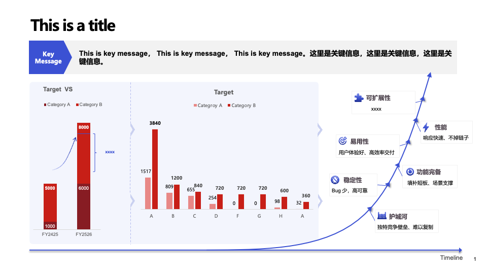
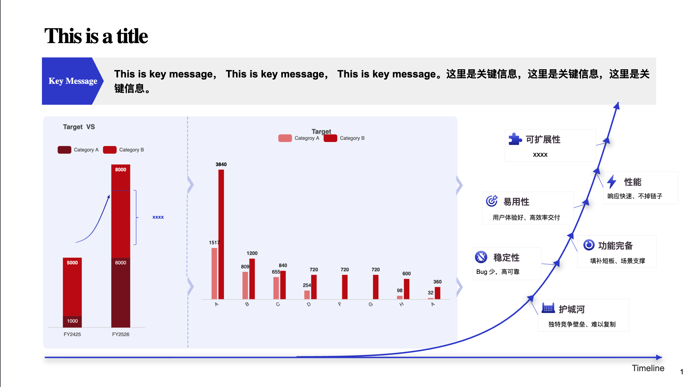
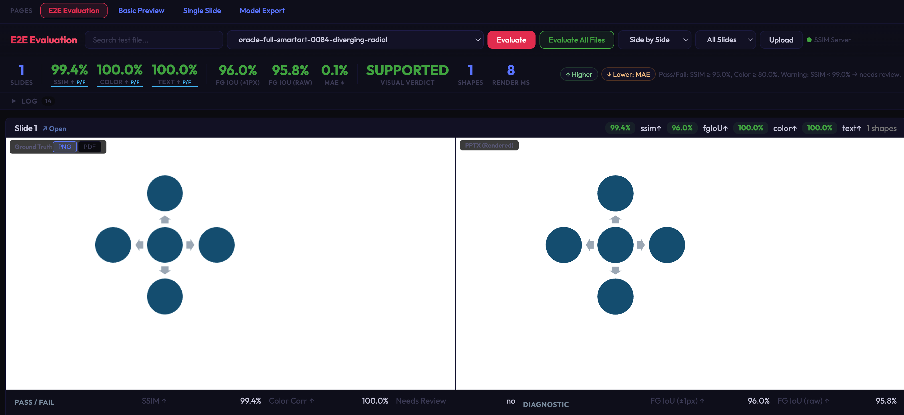

# pptx-renderer

[](https://github.com/aiden0z/pptx-renderer/actions/workflows/ci.yml) [](https://codecov.io/gh/aiden0z/pptx-renderer) [](https://www.npmjs.com/package/@aiden0z/pptx-renderer) [](https://github.com/aiden0z/pptx-renderer/blob/main/LICENSE) [](https://www.typescriptlang.org/) [](https://nodejs.org/) [](https://aiden0z.github.io/pptx-renderer/)

A high-fidelity, browser-native PPTX renderer that parses Office Open XML (`.pptx`) files and renders slides as HTML/SVG DOM.

Supports shapes, text, images, tables, charts, SmartArt, groups, backgrounds, gradients, pattern fills, and the full OOXML color pipeline — covering the vast majority of real-world PowerPoint content.

## Rendering Example

A complex slide with charts, text styles, shapes, and SmartArt — PowerPoint ground truth vs browser-rendered output:

<table>
<tr>
<th>PowerPoint (Ground Truth)</th>
<th>pptx-renderer (Browser)</th>
</tr>
<tr>
<td></td>
<td></td>
</tr>
</table>

## Visual Regression Testing

Every rendering capability is automatically verified against PowerPoint output. **352+ visual regression cases** with zero failures — covering 187+ preset shapes, 134+ SmartArt layouts, and 37+ fill/stroke/gradient variants.



<sup>E2E evaluation dashboard: side-by-side ground truth vs rendered output with SSIM, color histogram, and IoU metrics per slide.</sup>

> Ground truth data (PPTX + PDF pairs) is not committed to the repository due to file size. It can be regenerated locally via `scripts/one_shot_full_ground_truth.py` with Microsoft PowerPoint installed (macOS and Windows both supported) — see [`docs/TESTING.md`](docs/TESTING.md) for details.

## Install

```bash
npm install @aiden0z/pptx-renderer
# or
pnpm add @aiden0z/pptx-renderer
```

Requires Node.js 20+ for development. Runtime is browser-only.

## Quick Start

```ts
import { PptxRenderer } from '@aiden0z/pptx-renderer';

const container = document.getElementById('pptx-container')!;
const renderer = new PptxRenderer(container, {
  mode: 'list',
  width: 1200,
  listMountStrategy: 'windowed',
});

const resp = await fetch('/slides/demo.pptx');
await renderer.preview(await resp.arrayBuffer());
```

## API

### `new PptxRenderer(container, options)`

| Option                     | Type                       | Default     | Description                                                   |
| -------------------------- | -------------------------- | ----------- | ------------------------------------------------------------- |
| `mode`                     | `'list' \| 'slide'`        | `'list'`    | Multi-slide scroll or single-slide navigation                 |
| `width`                    | `number`                   | --          | Container width hint (omit for auto-detect via `clientWidth`) |
| `fitMode`                  | `'contain' \| 'none'`      | `'contain'` | Responsive fit or fixed size                                  |
| `zoomPercent`              | `number`                   | `100`       | Zoom level (10–400)                                           |
| `listMountStrategy`        | `'full' \| 'windowed'`     | `'full'`    | Windowed for large decks                                      |
| `listRenderBatchSize`      | `number`                   | `12`        | Slides per render batch                                       |
| `windowedInitialSlides`    | `number`                   | `4`         | Initial slides to mount in windowed mode                      |
| `windowedOverscanViewport` | `number`                   | `1.5`       | Viewport overscan multiplier                                  |
| `zipLimits`                | `ZipParseLimits`           | --          | Security limits for ZIP parsing                               |
| `onSlideError`             | `(index, error) => void`   | --          | Per-slide error callback                                      |
| `onNodeError`              | `(nodeId, error) => void`  | --          | Per-node error callback                                       |
| `onSlideRendered`          | `(index, element) => void` | --          | Called after each slide finishes rendering                    |
| `onSlideChange`            | `(index) => void`          | --          | Called when the active slide changes in slide mode            |

### Instance Methods

```ts
// Load and render a PPTX file. Returns slide count and parse+render time in ms.
const { slideCount, elapsed } = await renderer.preview(buffer); // ArrayBuffer | Uint8Array | Blob

renderer.goToSlide(index);        // Jump to slide (0-based)
await renderer.setZoom(150);      // Runtime zoom (10–400)
await renderer.setFitMode('none'); // Switch fit mode

// Render a single slide into an external container (useful for React/Vue integration, thumbnails).
// Returns the slide HTMLElement, or null if not loaded / index out of range.
const slideEl = renderer.renderSlideToContainer(index, container, scale?);

renderer.destroy();               // Cleanup blob URLs, observers, and DOM
```

### Instance Properties (read-only)

```ts
renderer.presentationData; // PresentationData | null — the parsed model, null before preview()
renderer.slideCount; // number — total slides (0 if not loaded)
renderer.slideWidth; // number — intrinsic slide width in px
renderer.slideHeight; // number — intrinsic slide height in px
renderer.currentSlideIndex; // number — currently active slide (0-based)
```

### Utility Exports

```ts
import { parseZip, buildPresentation, serializePresentation } from '@aiden0z/pptx-renderer';

const files = await parseZip(arrayBuffer); // PptxFiles
const presentation = buildPresentation(files); // PresentationData
const json = serializePresentation(presentation); // SerializedPresentation (JSON-safe)
```

#### Headless Slide Rendering

For advanced use cases (server-side screenshot, custom rendering pipeline):

```ts
import { renderSlide } from '@aiden0z/pptx-renderer';
import type { SlideRendererOptions } from '@aiden0z/pptx-renderer';

const slideEl = renderSlide(presentation, presentation.slides[0], {
  onNodeError: (nodeId, err) => console.warn(nodeId, err),
  mediaUrlCache: new Map(), // optional shared cache for blob URLs
});
document.body.appendChild(slideEl);
```

#### Model Types

All model types are exported for consumers building custom tooling:

```ts
import type {
  PresentationData,
  SlideData,
  SlideNode,
  ThemeData,
  BaseNodeData,
  ShapeNodeData,
  PicNodeData,
  TableNodeData,
  GroupNodeData,
  ChartNodeData,
  TextBody,
  TextParagraph,
  TextRun,
  Position,
  Size,
  NodeType,
  SerializedPresentation,
  SerializedSlide,
  SerializedNode,
  PptxFiles,
  ZipParseLimits,
  FitMode,
  PreviewInput,
} from '@aiden0z/pptx-renderer';
```

## Rendering Capabilities

### Shapes — 187+ Presets + Custom Geometry

All commonly used OOXML `DrawingML` preset shapes, organized by category:

| Category          | Count | Highlights                                                     |
| ----------------- | ----: | -------------------------------------------------------------- |
| Basic & Geometric |    70 | Rectangles, ovals, polygons, stars, arcs, clouds, gears, etc.  |
| Flowchart         |    30 | All standard flowchart shapes                                  |
| Arrows            |    22 | Directional, bent, curved, striped, chevron                    |
| Stars & Banners   |    17 | N-point stars, explosions, ribbons, scrolls                    |
| Callouts          |    17 | Rectangular, rounded, oval, cloud, line callout variants       |
| Connectors        |    12 | Straight, bent, curved (2-5 segments)                          |
| Action Buttons    |     9 | Multi-path 3D with darken/lighten face modifiers               |
| Math & Brackets   |    12 | Plus, minus, multiply, division, brackets, braces              |
| **Multi-path 3D** |   33+ | Bevel, cube, can, ribbons — multi-layer SVG with 3D appearance |

Custom geometry (`<a:custGeom>`) is also supported via a general-purpose OOXML path interpreter.

### Text — 7-Level Style Inheritance

Full OOXML text cascade: master → layout → shape → paragraph → run. Supports theme fonts, numbered/symbol/picture bullets, multi-level indent, vertical text, superscript/subscript, hyperlinks, and per-shape text insets.

### Charts via ECharts

Bar/Column, Line, Area, Pie, Doughnut, Radar, Scatter, Surface — each with 2D and 3D variants. Powered by [ECharts](https://echarts.apache.org/), with axis labels, legends, data labels, grid lines, series colors from theme, and custom number formats.

### Fill, Stroke & Color

- **Fills**: solid, linear/radial/rectangular gradient, 52+ pattern fills, image (stretch/tile)
- **Strokes**: 8 dash styles, 5 arrowhead types, compound lines, line joins
- **Colors**: full OOXML pipeline — `schemeClr` → `colorMap` remap → theme lookup → modifiers (lumMod, lumOff, tint, shade, alpha, satMod, etc.). All 6 color spaces supported.

### SmartArt, Tables, Images & More

- **SmartArt**: 134+ layouts via PowerPoint fallback data (embedded EMF/PDF rendered with [pdfjs-dist](https://mozilla.github.io/pdf.js/))
- **Tables**: OOXML table styles, cell merge, border inheritance
- **Images**: blob URL with crop, stretch/tile, video/audio placeholders
- **Groups**: coordinate remapping with recursive child rendering
- **Backgrounds**: slide → layout → master inheritance chain

## Architecture

Three-layer pipeline: **Parse -> Model -> Render**

```
ArrayBuffer (.pptx)
  -> ZipParser (jszip extraction)
  -> XmlParser (DOMParser + SafeXmlNode null-safe wrapper)
  -> buildPresentation() (assembles slides/layouts/masters/themes with relationship chains)
  -> SlideRenderer (background -> master shapes -> layout shapes -> slide shapes -> DOM)
```

Key design decisions:

- **SafeXmlNode**: Null-safe XML traversal — returns empty nodes instead of null, enabling deep chaining without null checks.
- **Lazy group parsing**: Group children stored as raw XML, parsed during rendering to avoid deep recursion in model layer.
- **Error isolation**: Per-node try/catch. A failed shape renders as a dashed-red placeholder; the slide continues.
- **No external CSS**: All styles inline. The library outputs self-contained HTML fragments.
- **Blob URL lifecycle**: Created for images/media, tracked in `mediaUrlCache`, revoked on `destroy()`.

## Performance

For large decks (50+ slides), use windowed mounting:

```ts
const renderer = new PptxRenderer(container, {
  listMountStrategy: 'windowed',
  listRenderBatchSize: 8,
  windowedInitialSlides: 4,
  windowedOverscanViewport: 1.5,
});
```

Details: [`docs/PERFORMANCE.md`](docs/PERFORMANCE.md)

## Security

- Treat PPTX input as untrusted. Always configure `zipLimits` in production.
- External hyperlinks are protocol-filtered (no `javascript:`, `data:`, etc.).
- Reporting: [`docs/SECURITY.md`](docs/SECURITY.md)

## Development

```bash
pnpm install
pnpm dev          # Vite dev server
pnpm test         # Unit tests (vitest)
pnpm test:coverage # Coverage report → coverage/
pnpm build        # Production build
pnpm dev:e2e      # Dev server + Python E2E API server
pnpm lint         # ESLint
pnpm typecheck    # tsc --noEmit
pnpm knip         # Dead code / unused exports detection
```

Dev pages at `http://127.0.0.1:5173`:

| Page                            | Purpose                                   |
| ------------------------------- | ----------------------------------------- |
| `/test/pages/index.html`        | Upload and preview any PPTX               |
| `/test/pages/render-slide.html` | Single slide at native resolution         |
| `/test/pages/e2e-compare.html`  | Side-by-side PDF vs HTML with SSIM scores |
| `/test/pages/export.html`       | Model JSON tree viewer                    |

## Documentation

| Doc                                       | Content                                                                |
| ----------------------------------------- | ---------------------------------------------------------------------- |
| [`ARCHITECTURE.md`](docs/ARCHITECTURE.md) | Parse/model/render pipeline design                                     |
| [`PERFORMANCE.md`](docs/PERFORMANCE.md)   | Tuning options and presets                                             |
| [`TESTING.md`](docs/TESTING.md)           | Unit/E2E strategy, two-layer metric system, visual regression workflow |
| [`CONTRIBUTING.md`](docs/CONTRIBUTING.md) | PR checklist, code quality tools, and workflow                         |
| [`SECURITY.md`](docs/SECURITY.md)         | Vulnerability reporting                                                |

## What's Not Yet Supported

3D effects, animations/transitions, equations (OMML), EMF/WMF vector rendering, shadow/reflection/glow effects, combo charts, secondary chart axes, embedded OLE objects, slide notes rendering.

## FAQ

**Does this run on Node.js?**
No. Rendering depends on browser DOM APIs.

**Why is my PPTX rendering incomplete?**
OOXML is a vast spec. Please open a compatibility issue with a minimal PPTX sample — the visual regression pipeline makes it straightforward to add coverage for new cases.

**How do I render 100+ slide decks efficiently?**
Use `listMountStrategy: 'windowed'` — it only mounts slides near the viewport.

## License

Apache License 2.0. See `LICENSE`.
